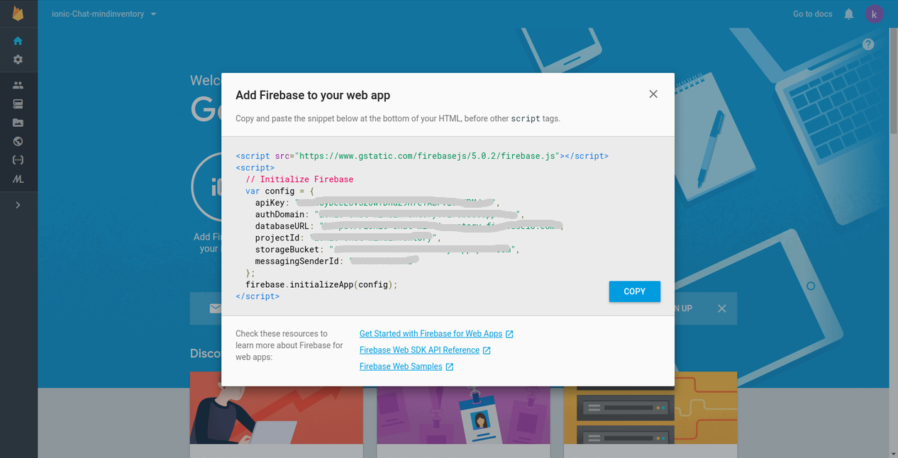

# IONIC chat with firebase

Ionic Firebase Chat is a sample chat widget powered by Firebase.

### Technologies used:

* Ionic Framework (v3)
* Firebase 3 (we’re not going to use AngularFire)

### Getting Started

These instructions will get you a copy of the project up and running on your local machine for development and testing purposes. See deployment for notes on how to deploy the project on a live system.
What things you need to install the software and how to install them 

### Prerequisites

First, we need to create new project in firebase

###### Step 1: 

> Login with your Firebase (https://firebase.google.com) & create new project


###### Step 2: 

> Click “add firebase to your web app” & get keys




### Creating Ionic Project

Once we created project from firebase, we can set up new Ionic project for our chat application

### Create new Ionic project
```javascript
ionic start  --v2 ionicfirechat blank
```

### Change your working directory

```bash
cd ionicfirechat
```

### Add your platform (if required)
```
ionic platform add android
ionic platform add ios
```

### Installing & Setup Firebase (app.component.ts)

Add firebase node_modules to your project

```bash
npm install firebase --save
```

import firebase in app.component.ts
```bash
import * as firebase from 'firebase';
```


Add configuration to app.component.ts; Replace with your Firebase Configuration

```javascript
let config = {
 apiKey: 'YOUR_APIKEY',
 authDomain: 'YOUR_AUTH_DOMAIN',
 databaseURL: 'YOUR_DATABASE_URL',
 projectId: 'YOUR_PROJECT_ID',
 storageBucket: 'YOUR_STORAGE_BUCKET',
 };
firebase.initializeApp(config);
```
Creating UI for chat (home.html)

```
<ion-header>
  <ion-navbar>
    <ion-title>chat</ion-title>
  </ion-navbar>
</ion-header>


<ion-content padding>
  <div id="chatMessage">
    <div class="message" *ngFor="let message of messages">
      <div [class]="message.userName == user ? 'innerMessage messageRight' : 'innerMessage messageLeft'">
        <div class="userName">{{ message.userName}}</div>
        <div class="msg">{{ message.message}}</div>
      </div>
    </div>
  </div>
</ion-content>

<ion-footer>
  <ion-toolbar>
    <ion-input type="text" name="message" placeholder="Message" [(ngModel)]="message"></ion-input>
    <ion-buttons end>
      <button ion-button icon-right color="royal" (click)="sendMessage()">
        <ion-icon name="md-send"></ion-icon>
      </button>
    </ion-buttons>
  </ion-toolbar>
</ion-footer>
```


you need to open the src/app/app.module.ts file and replace below code with your configuration settings:


Sending Messages to Firebase
When user clicks send button we need to call send() to insert messages into firebase & clear existing messages
```javascript
sendMessage(){
    this.db.list('/chat').push({
      userName: this.user,
      message: this.message
    }).then(() => {
      this.message = ''
    })
  }

```

Reading Messages from Firebase
   When user created new message, we need to display inside <ion-content>
   

```javascript
 this.db.list('/chat/').valueChanges().subscribe(data => {
      this.messages = data
    });

```
    
## Running the tests

Run below command line for automated tests of this system

```bash
  $ionic serve
```


